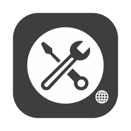

# Easy I18n

**该软件用于解决软件开发和运营过程中多语言管理的难题。**

该项目基于 Kotlin Multiplatform 开发，支持 MacOS、Windows 以及 Linux.

## 功能

在过去，当我们维护多语言词条的时候，对一个词条的改动可能需要查找多个多语言词条文档。Easy I18n 巧妙地将这些词条的编辑放在一个对话框里完成，操作更加便捷。重要功能：

- 加载和展示多语言词条，直观展示，快捷操作
- 支持删除、修改词条，并回写到多语言文件
- 支持自动翻译
- 支持多种开发平台：Android、iOS、Flutter、Compose 以及 Java 等
- 支持查询关键字和过滤多语言等
- 其他...

该项目已开源，我们欢迎你为该项目贡献代码或者提出建议～ 🎉

## 截图

优雅的外观，采用浅绿色设计，护眼、充满活力，让编辑体验更舒畅：

一个对话框里编辑一个词条的多个语言版本，化繁为简，方便快捷：

## 使用

你可以使用 Github Action 编译或者 clone 代码到本地之后进行编译。该项目目前已开源，代码位置：[source](../source/README.md).

付费版下载地址：

https://github.com/Shouheng88/easy-i18n-home/releases